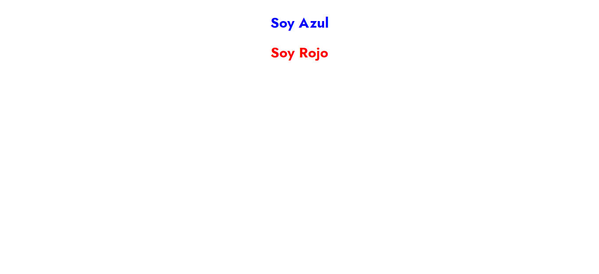
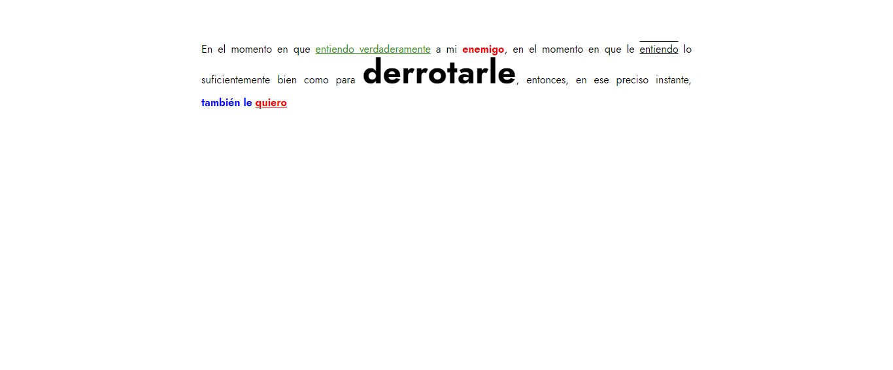

<h1>Taller 9 Cristopher Vargas Ruda</h1>

<h2> Información</h2>

Curso: full Stack Basico - Grupo 1

Profesor: Cristian Patiño

<h3>Link Página Web</h3>
<a href="https://cristophervargasruda.github.io/taller-9-full-stack/" target="_blank">Link página web</a>

<h2> Punto 1: Link figma</h2>

<a href="https://www.figma.com/file/nCLqjG0kchH2XwJctsi05k/Cristopher-Vargas---Figma-Excercise?type=design&node-id=9%3A3&mode=design&t=a5ZrOCJ4QpVSwomP-1" target="_blank">Link de Figma</a>

<h2>Punto 2: HTML</h2>

<h2> Punto 3: CSS</h2>

<h2> Punto 4: TÍTULOS</h2>

<h2> Punto 5: ESTILOS DE TEXTO</h2>

<h2> Punto 6: ENLACES</h2>

<h2> Punto 7-8: NAVEGACIÓN</h2>

<h2> Punto 9: TABLAS</h2>
